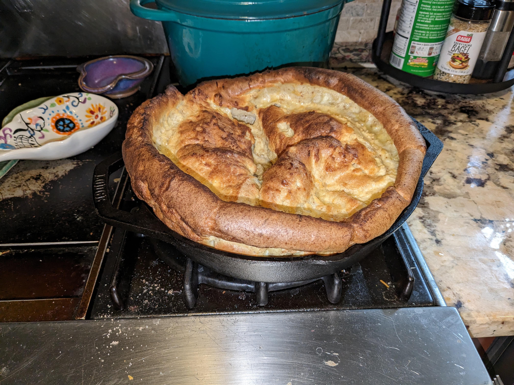

# Dutch Baby

A dutch baby is a puffed pancake that is baked at high heat in the oven.

## Wet Ingredients

|Ingredient|Amount|Other|
|:---|:---|:---|
| Eggs | 3 Large | Room Temperature |
| Whole milk | 3/4 Cup | Room temperature |
| Vanilla Extract | 1 Teaspoon | | 

Mix together wet ingredients in a bowl.

## Dry Ingredients

|Ingredient|Amount|Other|
|:---|:---|:---|
| Flour | 3/4 Cup | |
| Sugar | 1 Tablespoon | |
| Salt | 1 Pinch | |
| Nutmeg | 1 Teaspoon | |
| Cinnamon | 1 Teaspoon | Optional |

Sift together dry ingredients in a separate bowl.

## Other Ingredients

|Ingredient|Amount|Other|
|:---|:---|:---|
| Butter | 4 Tablesoons | Unsalted |
| Powdered Sugar | | Optional |
| Lemon Curd | | Optional

## Required Tools

- 8 to 12 Inch Cast Iron Skillet 
- Whisk or Mixer
- Sieve or Sifter

## Preperation

1. Let eggs and milk get to room temperature
2. Heat over to 415 degrees
3. Mix wet ingredients
4. Mix dry ingredients
5. Mix together wet ingredients into the dry with a whish or a mixer until it is smooth
6. Once oven is hot add butter to the cast iron skillet and let it melt in the oven for 3-5 minutes
7. Roll buttery around skillet and until most of it is covered 
8. Pour ingredients into the hot skillet
9. Bake for 18 minutes and check the color. If color is still light but it is puffed turn off oven and bake for 3-5 more minutes
